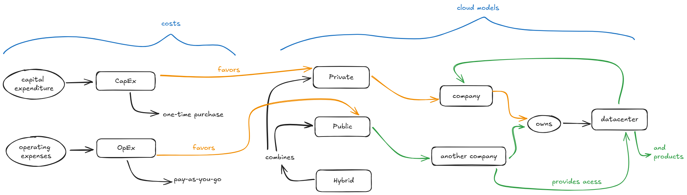
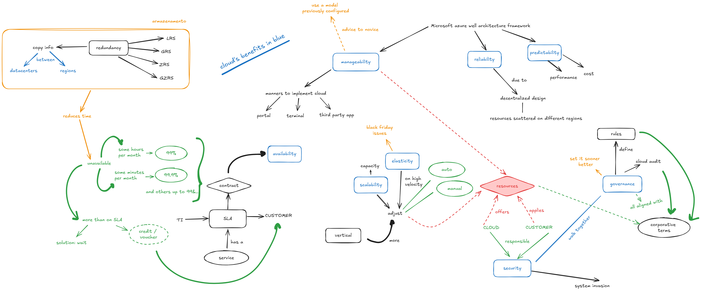
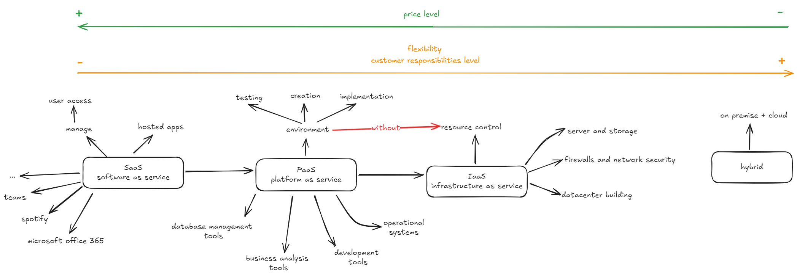
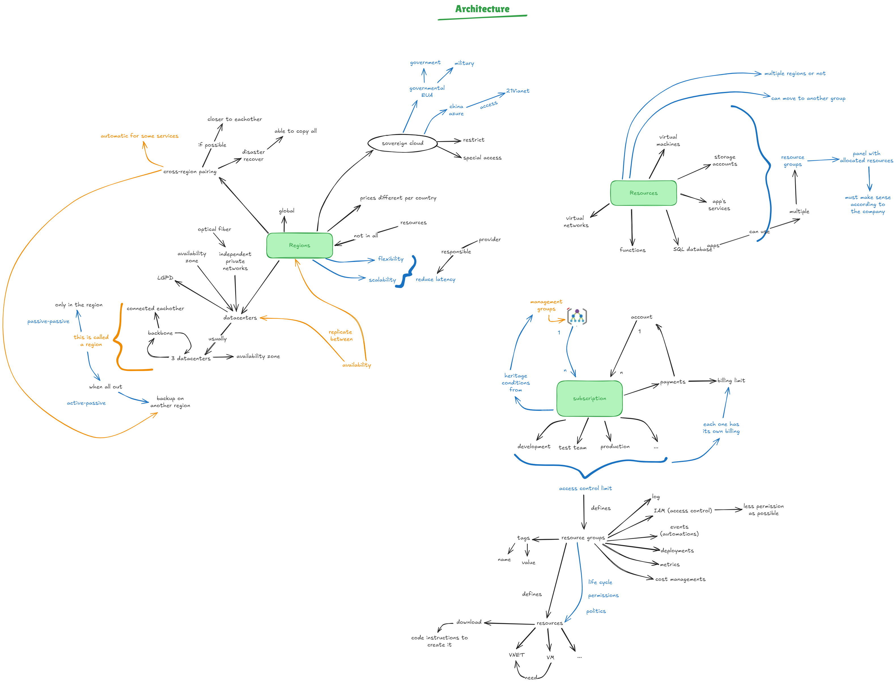
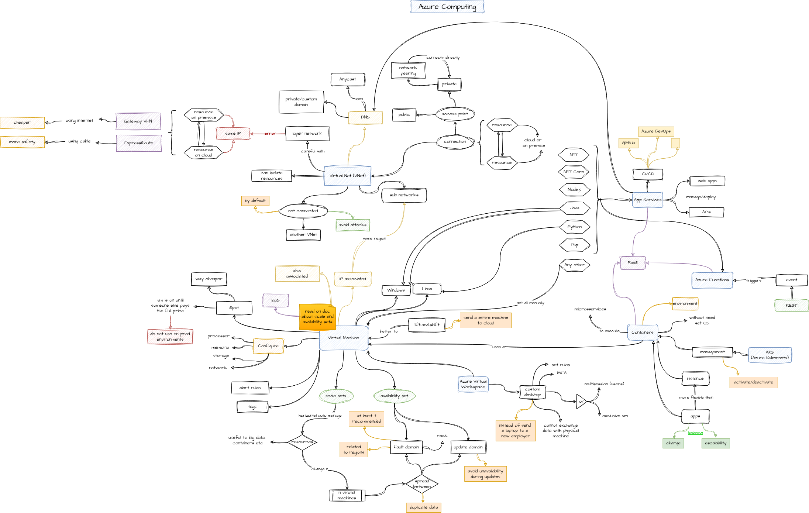
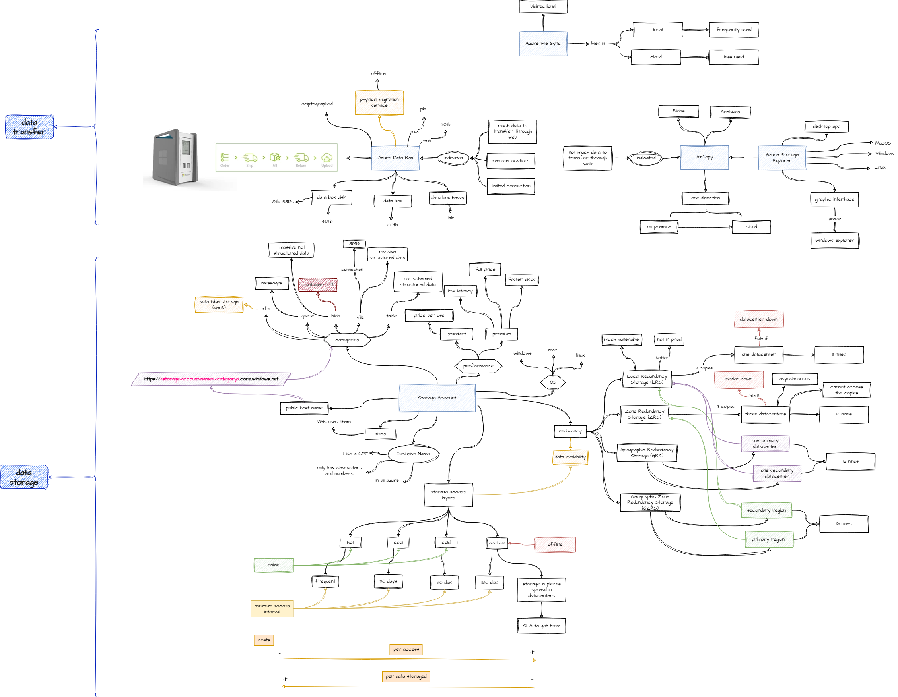
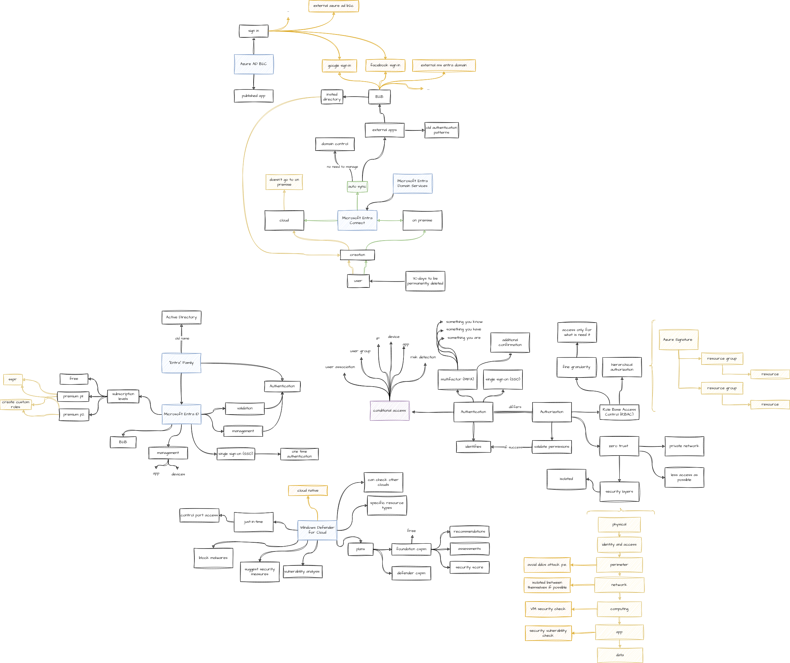

# DIO Bootcamp - Microsoft Azure Essentials

## Conceitos básicos

## Benefícios da Nuvem

## Tipos de Produtos

## Arquitetura e Serviços

### Processamento e Conexão

### Armazenamento e Storage Accounts

### Identidade, Acessoe e Segurança

